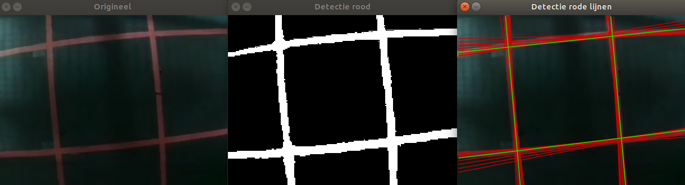

# EAGLE_IMP
Persoonlijke repository voor IMP (image processing) van het P&amp;O project EAGLE (3e bachelor burgerlijk ingenieur elektrotechniek).

## Beknopte beschrijving opdracht
Locatie en oriëntatiebepaling van de drone op basis van camerabeelden van de ondergrond.
Op de (donkere) ondergrond is een raster met rode lijnen aangebracht. Sommige vakken van het raster bevatten een QR-code,
die de geëncrypteerde instructies bevatten (bv. beweeg naar het vak (2,3), m.a.w. de coördinaten van het vak met de volgende QR-code en dus de volgende instructie).
Het IMP deel beslaat enkel de locatiebepaling en detectie van de QR-code, niet de decodering van de QR-code en de decryptie van de instructie.
Voor de beeldverwerking wordt gebruik gemaakt van OpenCV in C++.

## Features
* Herkenning van rode kleur in het raster
* Herkenning van rode lijnen in het raster
* Filtering van gelijkaardige lijnen: per lijn van het raster wordt slechts 1 lijn daadwerkelijk herkend
* Herkenning van de hoeken

## TODO
* [ ] Lijndetectie herschrijven met probabilistic hough tranform
* [ ] Locatie binnen het vak bepalen
* [ ] Aantal lijnen tellen die gekruist werden om absolute locatie te bepalen
* [ ] Soms zijn er geen 4 lijnen in beeld (meer/minder afhankelijk van verdere/dichtere afstand camera tot raster) -> afhandelen
* [x] Vak in het raster berekenen waar de camera zich bevindt (m.a.w. snijpunten rechten zoeken)
